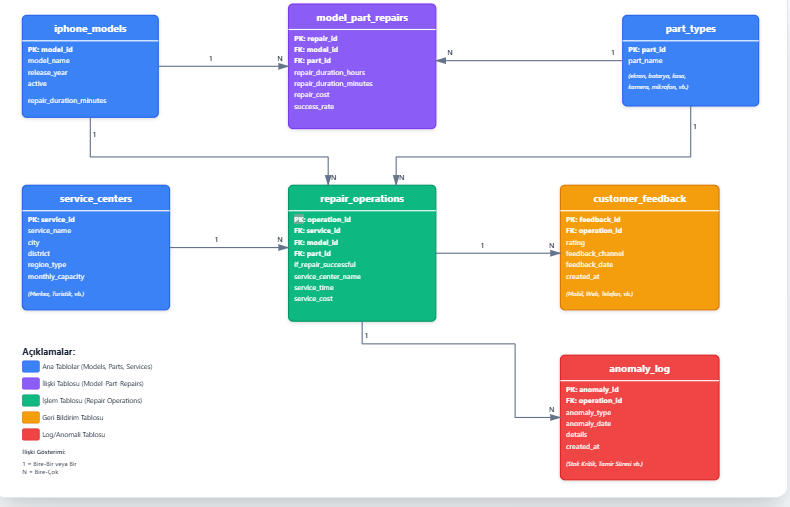

# 📱 iPhone Karar Destek Sistemi (KDS) - Node.js MVC Versiyonu

## 📖 Proje Hakkında

Bu proje, iPhone tamir servis verilerini analiz eden bir Karar Destek Sistemi'nin **MVC (Model-View-Controller)** mimarisine uygun olarak **Node.js** ile geliştirilmiş versiyonudur.

### 🎯 Projenin Amacı
- iPhone tamir operasyonlarını analiz etmek
- Servis merkezlerinin performansını değerlendirmek
- Anomalileri tespit etmek
- Gelecek dönem tahminleri yapmak

### 🏗️ Mimari Yapı

Proje **MVC (Model-View-Controller)** mimarisine tam uyumlu olarak tasarlanmıştır:
```
project/
├── app.js                          # Ana sunucu dosyası
├── config/                         # Yapılandırma dosyaları
│   └── constants.js                # Sabit değerler ve konfigürasyonlar
├── controllers/                    # Controller katmanı
│   └── iphoneController.js         # HTTP request/response yönetimi
├── services/                       # Service katmanı (İş mantığı)
│   └── iphoneService.js            # İş mantığı ve algoritmalar
├── models/                         # Model katmanı
│   └── iphoneModel.js              # Veritabanı işlemleri
├── routers/                        # Routing katmanı
│   └── iphoneRouter.js             # API endpoint tanımları
├── utils/                          # Yardımcı fonksiyonlar
│   └── dateHelpers.js              # Tarih işlemleri
├── db/                             # Veritabanı bağlantısı
│   └── mysql_connect.js            # MySQL connection pool
└── public/                         # Frontend (View katmanı)
    ├── index.html
    ├── css/
    └── js/
```

## 🔄 MVC Katmanları

### 📊 Model Katmanı (`models/`)
- Veritabanı ile doğrudan iletişim
- SQL sorguları ve veri erişimi
- **Sorumluluk**: Sadece veri okuma/yazma

### 🎮 Controller Katmanı (`controllers/`)
- HTTP request/response yönetimi
- Kullanıcı isteklerini Service katmanına yönlendirme
- Hata yönetimi (error handling)
- **Sorumluluk**: Sadece HTTP protokol yönetimi

### 💼 Service Katmanı (`services/`)
- İş mantığı ve hesaplamalar
- Algoritmaların çalıştırılması
- Model'den gelen verilerin işlenmesi
- **Sorumluluk**: Tüm business logic

### 🛣️ Router Katmanı (`routers/`)
- URL routing
- Endpoint tanımları
- **Sorumluluk**: İstekleri doğru controller'a yönlendirme

### 🎨 View Katmanı (`public/`)
- Kullanıcı arayüzü (HTML, CSS, JavaScript)
- **Sorumluluk**: Veri görselleştirme

## 🚀 Kurulum ve Çalıştırma

### Gereksinimler
- Node.js (v14 veya üzeri)
- MySQL (v5.7 veya üzeri)
- npm veya yarn

### 1. Projeyi İndir
```bash
git clone <repo-url>
cd iphone-kds-nodejs
```

### 2. Bağımlılıkları Yükle
```bash
npm install
```

### 3. Veritabanı Ayarları
`.env` dosyasını düzenleyin:
```env
PORT=3000
DB_HOST=127.0.0.1
DB_USER=root
DB_PASSWORD=your_password
DB_NAME=iphone_kds
```

### 4. Sunucuyu Başlat
```bash
# Production modunda
npm start

# Development modunda (nodemon ile)
npm run dev
```

Sunucu başarıyla başladığında:
```
🚀 iPhone KDS Node.js Sunucusu Başlatıldı
📍 Yerel Adres: http://localhost:3000
📊 API Test:    http://localhost:3000/api/kpi
```

## 📡 API Endpoints

### 1. KPI Kartları
```
GET /api/kpi?period=30
```
**Parametreler:**
- `period`: Analiz periyodu (gün) - varsayılan: 30

**Response:**
```json
{
  "status": "success",
  "data": {
    "total_repairs": { "value": 150, "change": 12.5 },
    "customer_satisfaction": { "value": "4.35", "change": 0.15 },
    "critical_anomalies": { "value": 5, "change": -2 },
    "avg_cost": { "value": 450 }
  }
}
```

### 2. Aylık Trend Grafiği
```
GET /api/monthly-trend?months=12
```

### 3. Anomali Listesi
```
GET /api/anomalies?severity=CRITICAL&limit=20
```

### 4. Servis Performansı
```
GET /api/services?period=30
```

### 5. Tahminler
```
GET /api/predictions
```

## 🧮 İş Mantığı ve Algoritmalar

### Servis Performans Skoru Algoritması
Servis merkezlerinin performansı 3 metrik üzerinden hesaplanır:
```javascript
Performance Score = (Rating × 0.40) + (Success Rate × 0.40) + (Volume × 0.20)
```

- **Müşteri Puanı (40%)**: 5 üzerinden alınan puanın 100'lük sisteme çevrilmesi
- **Başarı Oranı (40%)**: Başarılı tamir oranı
- **İşlem Hacmi (20%)**: Normalize edilmiş tamir sayısı

### Tahmin Algoritması
Son 90 günün verisi baz alınarak çeyrek bazlı projeksiyon:
```javascript
Q1: Baz × 1.05  // %5 artış
Q2: Baz × 1.10  // %10 artış
Q3: Baz × 1.15  // %15 artış
Q4: Baz × 1.20  // %20 artış
```

## 🎨 Kullanılan Teknolojiler

### Backend
- **Node.js**: JavaScript runtime
- **Express.js**: Web framework
- **MySQL2**: Veritabanı driver (Promise desteği)
- **dotenv**: Environment variables yönetimi
- **cors**: Cross-Origin Resource Sharing

### Frontend
- **HTML5**: Yapı
- **CSS3**: Stil
- **JavaScript (Vanilla)**: Etkileşim ve veri görselleştirme

## 📂 Önemli Dosyalar

| Dosya | Açıklama |
|-------|----------|
| `app.js` | Ana sunucu ve middleware yapılandırması |
| `iphoneController.js` | HTTP request/response yönetimi |
| `iphoneService.js` | İş mantığı ve algoritmalar |
| `iphoneModel.js` | Veritabanı sorguları |
| `constants.js` | Tüm sabit değerler |
| `dateHelpers.js` | Tarih işlem fonksiyonları |

## 🔐 Güvenlik

- ✅ SQL Injection koruması (parametreli sorgular)
- ✅ Environment variables ile hassas bilgi yönetimi
- ✅ CORS yapılandırması
- ✅ Error handling

## 📚 Proje Evrimi

Bu proje başlangıçta **Python Flask** ile backend, **JavaScript** ile frontend olarak geliştirilmiştir. Daha sonra tam olarak **Node.js** diline çevrilmiş ve **MVC mimarisi** uygulanarak yeniden yapılandırılmıştır.

### Python → Node.js Çevirisi
- Flask route'ları → Express.js route'ları
- Python fonksiyonları → JavaScript async/await
- SQLAlchemy → MySQL2 Promise API

### MVC Refactoring
- İş mantığı Controller'dan Service katmanına taşındı
- Yardımcı fonksiyonlar Utils klasörüne ayrıldı
- Sabit değerler Config dosyasına toplandı
- Separation of Concerns prensibi uygulandı

## 👨‍💻 Geliştirici Notları

### MVC Prensiplerine Uygunluk
- ✅ **Model**: Sadece veri erişimi
- ✅ **Controller**: Sadece HTTP yönetimi
- ✅ **Service**: Tüm iş mantığı
- ✅ **Separation of Concerns**: Her katman kendi sorumluluğu
- ✅ **Single Responsibility**: Her fonksiyon tek iş yapar
- ✅ **DRY**: Kod tekrarı yok

### Performans Optimizasyonları
- Connection pooling ile veritabanı bağlantı yönetimi
- Promise.all ile paralel sorgu çalıştırma
- Async/await ile non-blocking I/O

## 📄 Lisans

ISC License

---

## 📊 Veritabanı Şeması (ER Diyagramı)

Proje aşağıdaki veritabanı yapısını kullanmaktadır:



### Tablolar ve İlişkiler

#### 🔵 Ana Tablolar (Referans Tabloları)

**iphone_models** - iPhone model bilgileri
- `PK: model_id` (Primary Key)
- `model_name` - Model adı
- `release_year` - Çıkış yılı
- `series` - Model serisi
- `storage_duration_min` - Minimum depolama süresi

**service_centers** - Servis merkezi bilgileri
- `PK: service_id` (Primary Key)
- `service_name` - Servis adı
- `city` - Şehir
- `district` - İlçe
- `region_type` - Bölge tipi
- `technical_capacity` - Teknik kapasite
- `customer_satisfaction` - Müşteri memnuniyeti

**part_types** - Parça tipleri
- `PK: part_id` (Primary Key)
- `part_name` - Parça adı
- `average_delivery_time` - Ortalama teslimat süresi
- `warranty_valid_days` - Garanti geçerlilik süresi

#### 🟢 Merkezi Tablo (İşlem Tablosu)

**repair_operations** - Tamir işlem kayıtları
- `PK: operation_id` (Primary Key)
- `FK: repair_id` → model_part_repairs (Foreign Key)
- `FK: model_id` → iphone_models (Foreign Key)
- `FK: service_id` → service_centers (Foreign Key)
- `FK: part_id` → part_types (Foreign Key)
- `if_repair_successful` - Tamir başarılı mı?
- `operation_date` - İşlem tarihi
- `service_time` - Servis süresi
- `service_cost` - Servis maliyeti

#### 🟡 Log ve Geri Bildirim Tabloları

**customer_feedback** - Müşteri geri bildirimleri
- `PK: feedback_id` (Primary Key)
- `FK: operation_id` → repair_operations (Foreign Key) **[1:1]**
- `rating` - Puan (1-5)
- `feedback_channel` - Geri bildirim kanalı
- `feedback_score` - Geri bildirim skoru
- `response_time` - Yanıt süresi
- `closed_date_feedback_id` - Kapatılma tarihi

**anomaly_log** - Anomali kayıtları
- `PK: anomaly_id` (Primary Key)
- `FK: operation_id` → repair_operations (Foreign Key) **[1:N]**
- `anomaly_type` - Anomali tipi
- `severity` - Önem derecesi (CRITICAL, HIGH, MEDIUM, LOW)
- `anomaly_date` - Anomali tarihi
- `related_part_anomaly_category` - İlgili parça anomali kategorisi

#### 🟣 Bağlantı Tablosu

**model_part_repairs** - Model ve parça tamir ilişkileri
- `PK: repair_id` (Primary Key)
- `FK: model_id` → iphone_models (Foreign Key)
- `FK: part_id` → part_types (Foreign Key)
- `average_duration_hours` - Ortalama tamir süresi (saat)
- `requires_special_measure` - Özel önlem gerekiyor mu?
- `repair_cost` - Tamir maliyeti
- `success_rate` - Başarı oranı

### Tablo İlişkileri (Cardinality)

#### Ana İlişkiler
```
iphone_models (1) ──────► (N) model_part_repairs
part_types (1) ─────────► (N) model_part_repairs
model_part_repairs (1) ─► (N) repair_operations

iphone_models (1) ──────► (N) repair_operations
service_centers (1) ────► (N) repair_operations
part_types (1) ─────────► (N) repair_operations
```

#### Log ve Geri Bildirim İlişkileri
```
repair_operations (1) ──► (1) customer_feedback
repair_operations (1) ──► (N) anomaly_log
```

### İlişki Açıklamaları

1. **iphone_models → model_part_repairs (1:N)**
   - Bir iPhone modeli birçok farklı parça tamiri türüne sahip olabilir

2. **part_types → model_part_repairs (1:N)**
   - Bir parça tipi birçok farklı model için kullanılabilir

3. **model_part_repairs → repair_operations (1:N)**
   - Bir model-parça kombinasyonu birçok tamir işleminde kullanılabilir

4. **iphone_models → repair_operations (1:N)**
   - Bir model birçok tamir işlemine sahip olabilir

5. **service_centers → repair_operations (1:N)**
   - Bir servis merkezi birçok tamir işlemi gerçekleştirebilir

6. **part_types → repair_operations (1:N)**
   - Bir parça tipi birçok tamir işleminde kullanılabilir

7. **repair_operations → customer_feedback (1:1)**
   - Her tamir işlemi için en fazla bir müşteri geri bildirimi olabilir

8. **repair_operations → anomaly_log (1:N)**
   - Bir tamir işlemi sırasında birçok anomali tespit edilebilir

### Veritabanı İstatistikleri

- **Toplam Tablo Sayısı**: 7
- **Referans Tabloları**: 3 (iphone_models, service_centers, part_types)
- **İşlem Tabloları**: 2 (model_part_repairs, repair_operations)
- **Log Tabloları**: 2 (customer_feedback, anomaly_log)
- **Foreign Key İlişkileri**: 8
- **Çoka-çok İlişki**: model_part_repairs ile çözülmüş

### Veritabanı Normalizasyonu

Veritabanı **3. Normal Form (3NF)**'a uygundur:
- ✅ Birincil anahtarlar her tabloda tanımlanmış
- ✅ Tekrarlayan gruplar yok
- ✅ Kısmi bağımlılıklar yok
- ✅ Geçişli bağımlılıklar yok
- ✅ Referans bütünlüğü foreign key'lerle sağlanmış

**Not**: Bu proje eğitim amaçlı geliştirilmiştir ve MVC mimarisinin Node.js ile nasıl uygulanacağını göstermektedir.